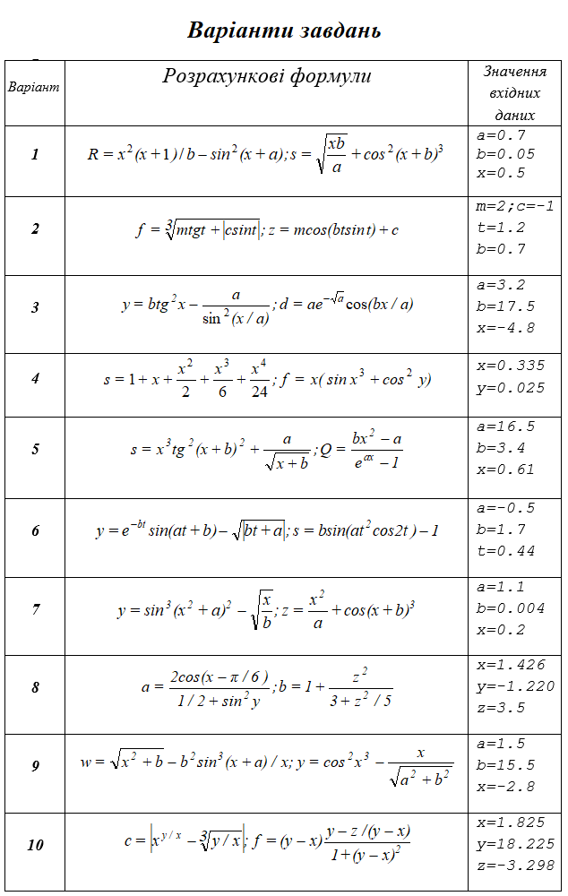

= Лабораторна робота №1

== Програмування лінійних алгоритмів.

=== Стандартні класи і їхні методи у мові Java

.	Створити клас, що має методи для обчислення на ЕОМ значень змінних, що зазначені у таблиці варіантів, за даними розрахунковими формулами і наборами вхідних даних.
.	Доповнити клас методом, що виводить на екран значення вхідних даних і результати обчислень, супроводжуючи вивід найменуваннями виведених змінних.
.	Додати в клас метод, що друкує поточну дату і час у вказаному форматі.
.	Доповнити клас методом введення початкових значень.
.	Створити метод, що вводить дані, обчислює потрібні значення за вказаними формулами, та друкує потрібні результати.
.	Доповнити клас методом main, що є необхідним для використання класу, як автономної програми, та виконати цю програму.

=== Короткі теоретичні відомості

*_Огляд структури Java-програми_*

Всі Java-програми містять в собі 4 основні різновиди будівельних блоків: класи (classes), методи (methods), змінні (variables) і пакети (packages). На якій би мові Ви не програмували раніше, Ви скоріш за все вже добре знайомі з методами, які є не що інше, ніж функції чи підпрограми, та зі змінними, в яких зберігаються дані. З іншого боку, класи представляють собою фундамент об’єктно-орієнтованих властивостей мови. Поки що, для простоти, можна вважати клас деяким цілим, що містить у собі змінні и методи. Нарешті, пакети містять в собі класи і допомагають компілятору знайти ті класи, що потрібні йому для компіляції прикладної програми.
Java-програма може містити в собі будь-яку кількість класів, але один з них завжди має особливий статус, і безпосередньо взаємодіє з оболонкою часу виконання. Цей клас називають первинним класом (primary class).
Коли програма запускається з командного рядка, системі потрібен тільки один спеціальний метод, що повинен бути присутнім у первинному класі, - метод main. Розглянемо приклад програми мовою Java:

[source,java]
----
// імпортування класу LocalDate зі стандартного пакету java.time
import java.time.LocalDate;

public class Main {
    public static void main(String[] S) {
        System.out.println("Hello, Java!");
        LocalDate d = LocalDate.now();
        System.out.println("Date: "+d.toString());
    }
}
----

Наведена програма виводить на екран повідомлення "Hello, Java!" та поточну системну дату.

*_Стандартні типи даних Java_*

Всі змінні та вирази у мові програмування Java можуть бути віднесені до однієї з двох великих груп типів:  примітивних типів (prіmіtіve types), або посилальних типів (reference types), що містять у собі типи, визначені користувачем, і типи масивів. До примітивних типів відносяться стандартні, вбудовані в мову типи для представлення чисельних значень, одиночних символів і логічних значень. Навпаки, усі посилальні типи є динамічними типами. Головні розбіжності між двома згаданими групами типів перелічені у наступній таблиці:

.Примітивні та посилальні типи
|===
|Характеристика |Примітивні типи |Посилальні типи

|Чи визначені в самій мові Java?
|Так
|Ні

|Чи мають визначений розмір?
|Так
|Ні

|Чи повинна для змінних цих типів виділятися пам'ять під час роботи програми?
|Ні
|Так
|===

На практиці найважливішим  розходженням між примітивними і посилальними типами є те, про що свідчить останній рядок цієї таблиці, а саме - що пам'ять для змінних посилального типу повинна виділятися під час виконання програми. Використовуючи змінні посилальних типів, ми повинні явно  вимагати необхідну кількість пам'яті для кожної змінної перш, ніж ми зможемо зберегти в цієї змінний деяке значення. Причина цього проста: оболонка часу виконання сама по собі не знає, яка кількість пам'яті потрібна для того чи іншого посилального типу.
Усього в мові Java визначено вісім примітивних типів, що перелічені в таблиці

.Примітивні типи мови Java
|===
|Тип |Розмір |Діапазон |Приклад

|byte
|1 байт
|від -128 до 127
|125

|short
|2 байти
|від -32768 до 32767
|-42

|int
|4 байти
|від -2147483648 до 2147483647
|198

|long
|8 байтів
|від -922372036854775808
до   922372036854775807

|12345678991

|float
|4 байти
|Залежить від розрядності числа
|1.2f

|double
|8 байтів
|Залежить від розрядності числа
|123.4

|boolean
|
|false, true
|true

|char
|2 байти
|Усі символи стандарту Unicode
|'z'
|===

*_Стандартні математичні функції_*

Оскільки мова Java є об’єктно-орієнтованою, то математичні функції повинні належати до деякого класу. Фактично існують два класи, що визначають математичні операції: Math та StrictMath, Останній призначений для виконання обчислень із ”підвищеною точністю”, але через поширення вбудованих у процесори математичних модулів, ”звичайна” і ”підвищена” точність у сучасній Java не розрізняються. Тому найчастіше використовується саме клас Math.

Усі стандартні математичні функції в мові Java є статичними методами класу Math, який визначений з модифікатором final, тобто не припускає спадкування. Крім того, клас Math має декілька визначених констант, наведемо дві з них:

|===
|Константа |Значення

|Math.PI
|3.1415926…

|Math.E
|2.7182818
|===

Основні статичні методи класу Math наведені у наступній таблиці:

|===
|Функція – метод  |Пояснення

|Math.abs(x)
|Модуль числа x

|Math.acos(x)
|Арккосинус x

|Math.asin(x)
|Арксинус x

|Math.atan(x)
|Арктангенс x

|Math.cbrt(x)
|Кубічний корінь з x

|Math.ceil(x)
|Найближче число до х, що не містить дробової частини і більше за x

|Math.cos(x)
|Косинус x

|Math.exp(x)
|Експонента від x

|Math.floor(x)
|Найближче число до х, що не містить дробової частини і менше за x

|Math.hypot(x,y)
|Гіпотенуза прямокутного трикутника зі сторонами x, y

|Math.log(x)
|Натуральний логарифм x

|Math.max(x,y)
|Більше з двох чисел

|Math.min(x,y)
|Менше з двох чисел

|Math.pow(x,y)
|X в степені Y

|Math.random()
|Випадкове число з проміжку [0;1)

|Math.rint(x)
|Найближче число до х, що не містить дробової частини

|Math.round(x)
|Найближче до x ціле число

|Math.sin(x)
|Синус x

|Math.sqrt(x)
|Квадратний корінь з x

|Math.tan(x)
|Тангенс x

|Math.toDegrees(x)
|Переведення кута з радіанів у градуси

|Math.toRadians(x)
|Переведення кута з градусів у радіани
|===

*Примітка.*  У мові Java є можливість імпорту статичних змінних та методів класу за допомогою директиви `import static` на початку програми. Наприклад:

[source,java]
----
import static java.lang.Math.*;
// імпортування статичних змінних і методів класу Math

public class OurPrimaryClass {
    public static void main(String[] S) {
        double x;
        x = sin(PI/6);
       // без статичного імпорту треба писати x=Math.sin(Math.PI/6);
        System.out.println(x);
    }
}
----

*_Виведення даних у консолі Java-програм_*

Для виведення інформації на консоль використовуються методи стандартного класу PrintStream:

- print
- println
- printf
- format (точна копія printf)

Кожна програма мовою Java містить стандартний об’єкт типу `PrintStream` – `System.out`. Таким чином, виведення інформації на екран буде записуватися як `System.out.print(…)`, `System.out.println(…)`, або `System.out.printf(…)`.
Методи `print` та `println` повинні завжди мати один параметр – вираз будь-якого типу, що може бути автоматично приведений до рядкового типу.

Наприклад,
[source,java]
----
System.out.println("2+2="+(2+2)); // буде виведено 2+2=4
System.out.println("Значення суми="+s);
// буде виведено Значення суми=ххх , де ххх – значення змінної S
----

Методи `printf` та `format` можуть мати список параметрів, що розділяються комами. Перший параметр – рядок, що містить текст для виведення і форматні шаблони для виведення значень інших параметрів.
Наприклад, якщо a=2, b=3

[source,java]
System.out.printf("Значення %d + %d = %d", a, b, a+b);
// буде виведено Значення 2 + 3 = 5

Форматні шаблони для виведення звичайних, символьних та числових типів мають наступний синтаксис:

`%[індекс_аргумента$][опції][ширина][.точність]перетворення`

Необов’язковий параметр `індекс_аргумента` є цілим числом, що вказує позицію в списку аргументів. Посилання на перший аргумент буде записане як "1$", на другий – "2$", і т.д.

Необов’язковий параметр опції –  це набір символів, що змінюють формат виведення. Набір припустимих опцій залежить від типу перетворення.

Необов’язковий параметр ширина – це невід’ємне ціле число, що показує мінімальну кількість символів, що їх треба вивести.

Необов’язковий параметр точність –  це невід’ємне ціле число, що зазвичай використовується для обмеження кількості символів, що будуть виведені. Його дія залежить від параметру перетворення.

Обов’язковий параметр перетворення – це один символ, що вказує як аргумент буде відформатований. Набір припустимих перетворень для вказаного аргументу залежить від типу даних аргументу.

Основні типи - символи перетворень

|===
|Перетворення |Категорія |Опис

|'b', 'B'
|boolean
|Якщо аргумент arg є null, тоді результатом буде "false". Якщо  arg належить до типу boolean або Boolean, то результатом буде рядок – ”true” або ”false” в залежності від значення arg. У всіх інших випадках результатом буде "true".

|'s', 'S'
|general
|Якщо аргумент arg є null, тоді результатом буде "null". Якщо arg має метод formatTo, то він буде викликаний. Інакше, результат буде отриманий через виклик arg.toString().

|'c', 'C'
|character
|Результатом буде символ Unicode

|'d'
|integral
|Результат буде відформатований, як ціле десяткове число

|'e', 'E'
|floating point
|Результат буде відформатований, як число з плаваючою точкою у ”науковому” форматі

|'f'
|floating point
|Результат буде відформатований, як десяткове число

|'g', 'G'
|floating point
|Результат буде відформатований, як число з плаваючою точкою у ”науковому” форматі

|'t', 'T'
|date/time
|Префікс для символу перетворень дати і часу.

|'%'
|percent
|Результатом буде символ '%' ('\u0025')

|'n'
|line separator
|Результатом буде символ, що відокремлює рядки в залежності від платформи.
|===

*_Введення даних з консолі_*

Для введення даних у мові програмування java можна скористатися різними засобами. Один з них  використовує спеціальний об’єкт, що належить до класу Scanner. Цей клас містить методи для введення найрізноманітніших типів даних. Приклад його використання наведений нижче:

[source,java]
----
import java.io.*;
import java.util.*;

public class InOutExample {
    public static void main(String[] s) {
        Scanner s = new Scanner(System.in);
        // Читання цілого числа з рядка
        int i = s.nextInt();
        // Читання дійсного числа з рядку
        double x = s.nextDouble();
	  //...................................
    }
}

----

== Варіанти завдань

